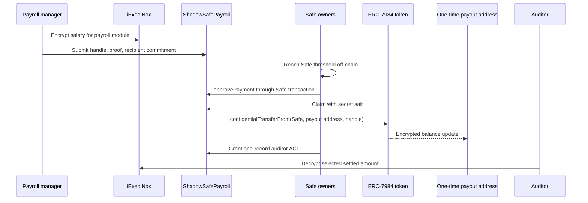
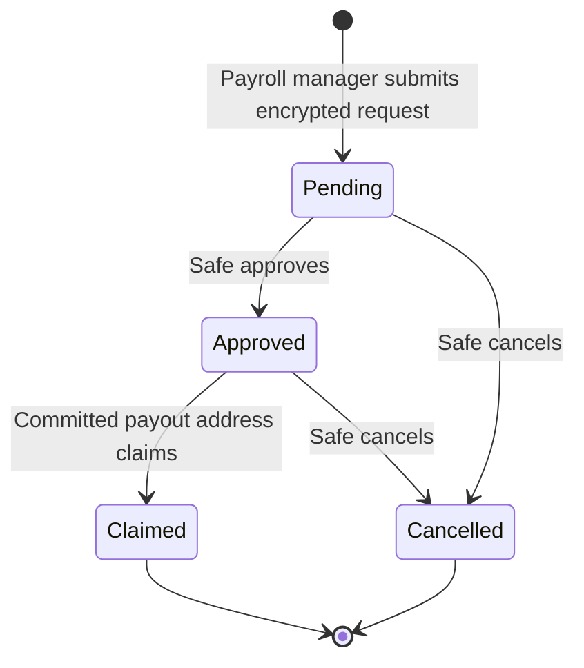

# Architecture

ShadowSafe Payroll adds a confidential approval and settlement path to a Safe-held treasury.

## Trust and custody

- The Safe remains the token holder.
- The module can move the Safe's ERC-7984 balance only while its time-bounded operator permission is active.
- Each payment needs an explicit call from the Safe before it becomes claimable.
- The payroll manager can prepare encrypted requests but cannot approve, cancel, audit, or change its own role.
- iExec Nox's gateway and TEE stack provide confidential computation and handle encryption.

## Privacy boundary

| Data                           | Visibility              | Mechanism                                        |
| ------------------------------ | ----------------------- | ------------------------------------------------ |
| Salary amount                  | Confidential            | Nox `euint256` handle                            |
| Employee identity before claim | Off-chain               | Commitment to a one-time payout address and salt |
| Payout address after claim     | Public                  | Required by ERC-7984 account settlement          |
| Salary for recipient           | Selectively decryptable | Nox ACL grant on balance and settlement handles  |
| Salary for auditor             | Selectively decryptable | Safe-controlled per-payment ACL grant            |
| Safe, module, token, timing    | Public                  | Normal blockchain metadata                       |

This is confidentiality, not full anonymity. A reused payout address, gas funding trail, timing pattern,
or off-chain disclosure can link the claim back to an employee. The demo therefore uses a fresh payout
address and never claims that the final address is hidden from the chain.

## State machine

## Security decisions

- The recipient commitment uses `keccak256(abi.encode(address, bytes32))`, preventing ambiguity.
- The caller address is part of the claim check, so copying another claimant's salt cannot redirect funds.
- Claim status changes before the external token call and the function is reentrancy guarded.
- Nox permission for the token is transient; the token receives access only during settlement.
- The module rechecks the Safe's ERC-7984 operator grant at claim time, so an expired or revoked grant fails
  without consuming the approved payment.
- Auditor grants are additive and currently irreversible because the Nox SDK exposes no persistent revoke helper.
- The demo token and `MockSafe` are test fixtures, not production treasury contracts.

## Confidential transfer failure semantics

ERC-7984 cannot publicly revert on an insufficient encrypted balance without leaking information. The Nox token
therefore returns an encrypted zero as the actual transferred amount when the requested transfer cannot be
completed. `settledAmount` records that actual encrypted result, and the recipient can decrypt it, but the claim
is deliberately one-shot to prevent replay and double payment. Treasury funding and operator expiry must be
checked operationally before the Safe approves a payment.

## Production work still required

- Independent Solidity and integration audit.
- Validation against an official Safe deployment and the exact Nox-supported ERC-7984 token selected by the team.
- Operational controls for Safe operator expiry and emergency cancellation.
- Relayed or sponsored claims if payout-address gas-funding privacy is required.
- A formal privacy threat model covering network, browser, RPC, and payroll-operator metadata.
